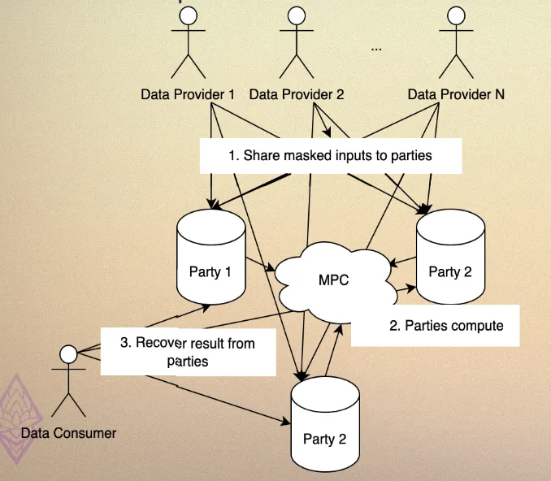
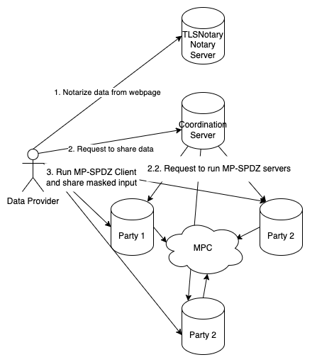
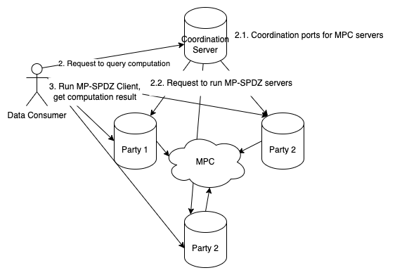
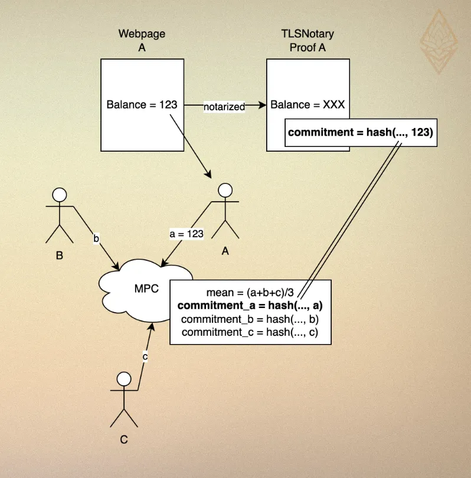

# MPCStats Demo Infrastructure

## 1. Introduction

MPCStats Demo Infrastructure provides a boilerplate for privacy-preserving statistical analysis and developers can use this boilerplate to build their own privacy-preserving applications by modifying existing components or extending functionality. We support use cases with this pattern:
1. Data providers generate a proof for their data from some website using [TLSNotary](https://tlsnotary.org/). This proof does not reveal their data.
2. Arbitrary computation can be performed on all data providers' masked data using MPC (we're using [MP-SPDZ](https://github.com/data61/MP-SPDZ/) as the MPC framework). Computation is defined with Python DSL and support common statistical operations.
3. Data consumers can query the results.

Data consumers can be convinced the statistical results are correct without revealing their data.

The current implementation demonstrates our [Devcon demo](https://demo.mpcstats.org/) where participants collaboratively compute the statistical results from their ETH balance on Binance. This docs explain how everything works, how to modify the boilerplate, and how to deploy the infrastructure.

---

## 2. Architecture Overview
We use a client-server architecture, where there are 3 parties running all the time while data providers and consumers serve clients, i.e. data providers can go offline after providing their data and data consumers can go offline after querying the results.

The core components are:

- **Coordination Server**: provides API for data providers and consumers to interact with, and coordinates computation sessions between computation parties.
  - Verifies TLSNotary proof and prevents Sybil attacks.
  - Implements rate-limiting to prevent DoS attacks.
- **Computation Parties**:
  - Store secret-shared data received from data providers.
  - Perform MPC computations defined in DSL
  - Return results to data consumers.
  - Each party operates independently to ensure security.
- **TLSNotary Server**: data providers prove their data using it.
  - Modified from the original TLSNotary server so the proved data is a commitment instead of plaintext. Later in MPC program, we verify the commitment matches the data provider's data.
- **(Optional) Client API**:
  - It's essentially a data consumer, but it's a REST API service that periodically polls computation parties for results and caches them
  - Provides a simple interface for end users to query statistical results without interacting with the coordination server (and thus triggering MPC computations)

### Workflow

#### Data Proving and Sharing

1. Data providers prove their balance using the Notary Server and obtain a TLSNotary proof.
2. Data providers submit the TLSNotary proof to the Coordination Server, signaling their intent to share data.
3. The Coordination Server instructs computation parties to initiate an MPC session on designated ports and wait for data providers to connect.
4. Data providers run a client to secret-share their balance with the computation parties.
   - Computation parties verify if the secret-shared balance matches the one in the TLSNotary proof. If not, they reject the data provider.

#### Query Computation

1. Data consumers submit a query to the Coordination Server, requesting aggregated statistics.
2. The Coordination Server instructs computation parties to perform MPC on the shared data.
3. Data consumers retrieve the statistical results from the computation parties through the client interface.

### Security Considerations

- Coordination Server:
  - Centralized to streamline coordination but does not access or store plaintext data.
  - Rate-limiting and participant verification reduce the risk of Sybil attacks and DoS.
    - In Binance case, we expose a field "uid" in the TLSNotary proof, which is a unique identifier for each data provider. This way we prevent Sybil attacks by checking if the uid is unique.
- Notary Server:
  - Participants trust the Notary Server to generate a correct proof.
  - By default, we use a local notary whose private keys are exposed, so it's possible for people to forge it. Running a remote notary server can mitigate this risk.
- Computation Parties: Computation parties must be operated by non-colluding entities to prevent reconstruction of participants' balances.

## 3. Deploying the Infrastructure
(To-be-completed)

### Local Deployment
(To-be-completed)

### Remote Deployment
(To-be-completed)

## 4. Customizing the Infrastructure
(To-be-completed)

Developers can modify and extend the boilerplate to create their own privacy-preserving applications.

- Customization Areas:
  1. TLSNotary Integration: Adjust the prover and verifier to handle new data sources.
  2. MPC Program: Modify or extend the statistical computations to fit specific needs.
  3. Database and Storage: Customize how data is stored or integrated into external systems.

- Steps to Customize:
  1. Modify the TLSNotary prover and verifier for new data sources.
  2. Update the MPC program to include additional or modified statistical operations. Use MPCStats library for statistical operations.
  3. Deploy and test the customized application locally before scaling to a remote setup.

## 5. Technical Details

### Input Authentication

- Data providers prove their Binance balance using TLSNotary.
- During MPC, the balance is used as a private input, and a TLSNotary commitment is calculated and revealed alongside the stats result.
- All parties verify the TLSNotary proof to ensure that the private input matches the commitment, providing input correctness.

### Client Interface

In vanilla MPC, for data consumers to know the results from a computation, all data providers and consumers must stay online all the time, but that's not practical for

- Data Providers: Share masked balances with 3 computation parties via secret sharing. This allows them to go offline after providing their data.
- Computation Parties: Perform MPC to compute the statistical result.
- Data Consumers: Query results from the computation parties, ensuring asynchronous participation.

### Benchmarks
MPC Protocol: Settled on [`mal-rep-ring`](https://mp-spdz.readthedocs.io/en/latest/readme.html#honest-majority), a malicious secure, honest majority protocol, i.e. it tolerates up to 1/3 malicious parties. We benchmarked through all MPC protocols provided by MP-SPDZ and found it's the most practical option for our demo:
- TLSNotary Data Commitment: Identified as a bottleneck operation but performed efficiently, taking roughly 1 second for 1-byte data.
- Mean Calculation: Computes the mean of 10,000 numbers in under 0.2 seconds.

See [here](https://pse-team.notion.site/Choosing-a-Suitable-MPC-Protocol-fffd57e8dd7e8034b4d7c75b02d79ed3) for more details.

### Comparison with Existing Works
(To-be-completed)

## 6. Potential Enhancements
- Enhance verifiability using Trusted Execution Environments (TEE) or collaborative SNARKs.
- Explore integration with Fully Homomorphic Encryption (FHE) for asynchronous workflows.
